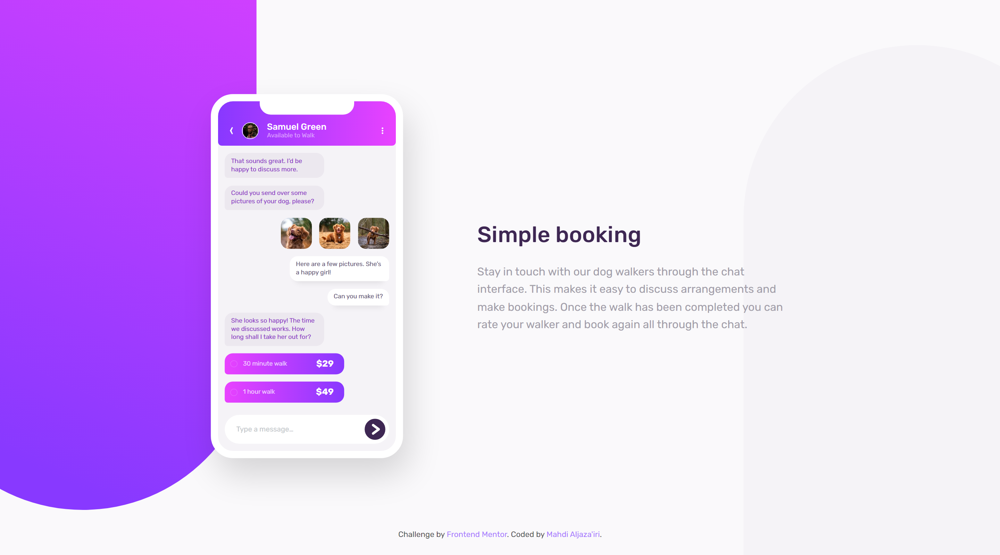

# Frontend Mentor - Chat app CSS illustration solution

This is a solution to the [Chat app CSS illustration challenge on Frontend Mentor](https://www.frontendmentor.io/challenges/chat-app-css-illustration-O5auMkFqY).  
Frontend Mentor challenges help you improve your coding skills by building realistic projects. 

\*Me\* : I agree 👍

## Table of contents

- [Overview](#overview)
  - [The challenge](#the-challenge)
  - [Screenshot](#screenshot)
  - [Links](#links)
- [My process](#my-process)
  - [Hardest part](#hardest-part)
  - [What I learned](#what-i-learned)
  - [Known issues](#known-issues)
  - [Continued development](#continued-development)
- [Tools](#tools)
- [Author](#author)

## Overview

### The challenge

Users should be able to:

- View the optimal layout for the component depending on their device's screen size
- **Bonus**: See the chat interface animate on the initial load

### Screenshot

### Links

- Solution URL: <https://www.frontendmentor.io/solutions/a-soso-responsive-page-with-css-Mcaa_B6kCZ>
- Live Site URL: <https://chat-app-css-illustration-solution-1234.netlify.app>

## My process

### Hardest part

Strangely enough, the hardest part of building this page was the background. Not the illustration itself. Mostly because at first, I decided to do it with pseudo-elements instead of a `background-image` inorder to achieve a responsible background. The decision which resulted in scrolling issues because the pseudo-elements had to extend out of the viewport, but not out of the body -so they scroll vertically on mobiles.

Eventually I realized setting multiple background images was the best approach for such situation. But the perfectionist inside me is still unconvinced though 😐.

### What I learned

The `transform` property doesn't change the proportions of an element..  
That's the reason for the first issue in the next section.

### Known issues

- Not suitable for landscape displays with less than 650px height viewport.
- Styles contain plenty of _Magical Numbers_ 🪄.
- No animation.

### Continued development

I need to speed up the process. That's it imo.

## Tools

- [Dev Docs](https://devdocs.io) - The resource I was constantly referring to throughout the process. It's an offline web app that has a huge collection of documentations.
- [Brackets](https://brackets.io) - My text editor. Not as powerful as VSCode, but still my favorite.
- [Inkscape](https://inkscape.org) - An open-source SVG editing software. I used it to make the icons and the background of the page. Yup, all icons are original 🙂.
- Chrome - This web page was only tested on Chrome. 

## Author

- GitHub - [Mahdi Aljaza'iri](https://github.com/MahdiAljazairi)
- Frontend Mentor - [@MahdiAljazairi](https://www.frontendmentor.io/profile/MahdiAljazairi)
